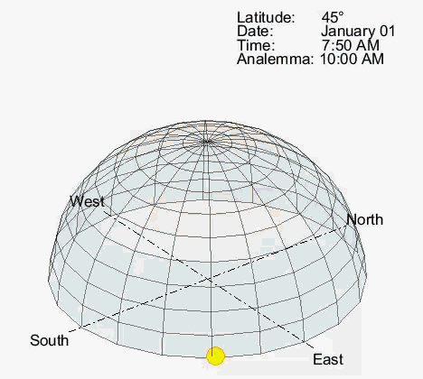

# Analyzing the Sun's Path over the Year

This codebase generates the trajectory of the sun over the course of the year at a given latitude. This can be used to understand potential irradiance at a given site, or study solar phenomena, such as the solar analemma.

The trajectory of the sun in the sky depends on the time of year and the latitude of observation due to the tilt of Earth and the eccentricity of the orbit around the sun. The "analemma" is a phenomenon that results from the eccentricity and obliquity of Earth's orbit with the sun. If you set up a camera and take a photograph of the sun at 24 hour intervals over the course of a year, an "infinity-like" symbol will appear in the sky. The analemma represents the difference between "apparent solar time" (noon = sun directly overhead) versus "mean solar time" (clock counting 24 hour days).

Two scripts for solar analysis (sunTrajectoryAnalysis) are present in this repository
- *.MLX uses the MATLAB Live Script Markup Approach
- *.M is the traditional Text-based Approach

## Getting Started

To run the analysis:
1) Open the "sunTrajectoryAnalysis" script
2) Select a given observation latitude (default is 45 degrees)
3) Select a time of day for a snapshot of the sun's position (to generate the analemma)
